# Classification with Kmeans

## Project Overview


## Dataset Overview

Dataset provided (`..data/raw/recommendation_training_data.csv`)

## Columns

- artist_name: The name of the artist
- track_name: The name of the song
- release_date: When this song was released
- genre: The categorical genre of this song

- lyrics: The pre-tokenized lyrics of this song
- len: The number of words in the lyrics of this song
- the remaining columns are thematic columns from 0 to 1 expressing how likely it is that this song’s lyrics have something to do with that particular theme

## Goal
Use an unsupervised learning algorithm to categorize songs

## Project Workflow

### Part 1: Exploratory Data Analysis
#### Load data

```python
import pandas as pd
import numpy as np
import matplotlib.pyplot as plt
import seaborn as sns

df = pd.read_csv('../data/raw/recommendation_training_data.csv')
```
#### Visualizing data


](images/image.png)
A breakdown of the songs by genre


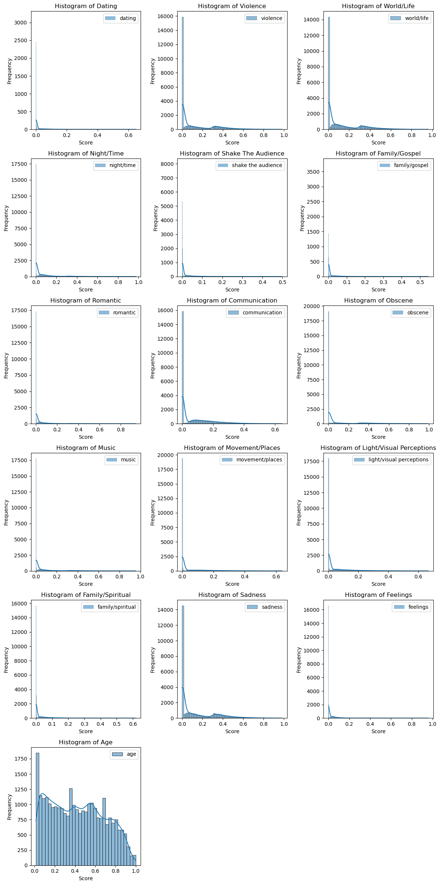](images/image-1.png)
I took a look at the distributions of the thematic columns, and realized that they were all right skewed. So I decided to look at the columns with a log transformation

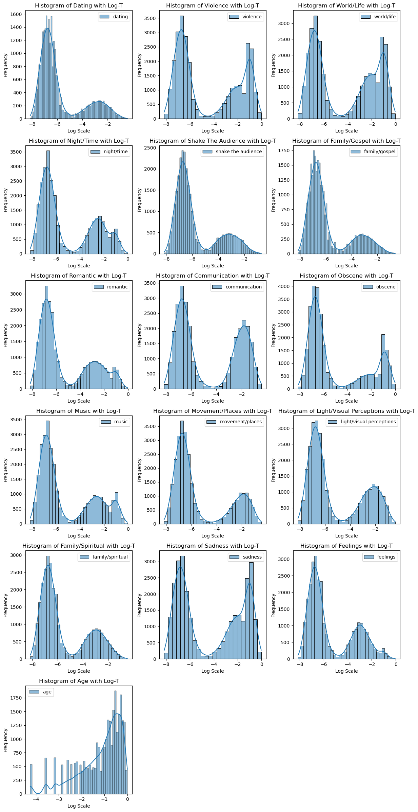](images/image-2.png)

All columns except for age, showed a bimodal distribution. This informed me that perhaps I should log transform all columns.


### Part 2: Data Transformation
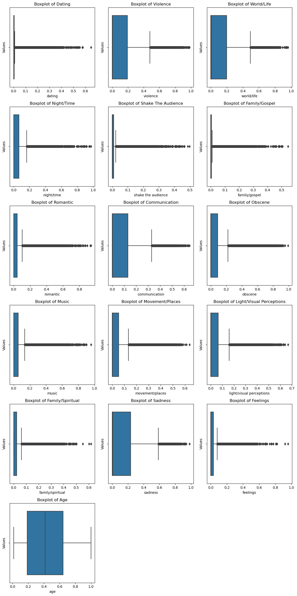](images/image-3.png)
I viewed the data as boxplots before and after the log transformations.

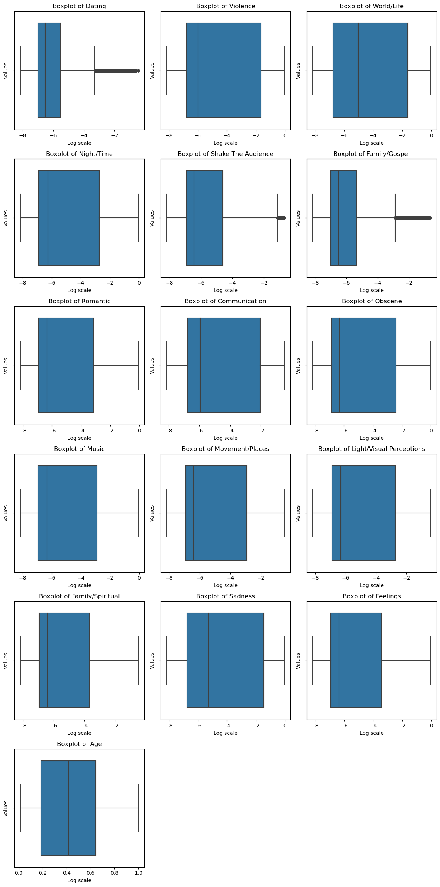](images/image-4.png)
The log transformations significantly reduced the number of outliers.

I attempted to remove the outliers by attempting the IQR method and winsorization. However the IQR method ended up dropping too many observations. I wasn't confident in my execution of the winsorization technique as it didn't ouput the results I had hoped.


I proceeded to drop the following columns `['Unnamed: 0', 'artist_name', 'track_name', 'release_date', 'lyrics']`, as the unnamed column appeared to have been an index, and the other columns contained strings. I also found that the 'age' and 'release_date' columns had a perfect negative correlation, so I decided on dropping 'release_date' as well. I then scaled the data and then one hot encoded the 'genre' and 'topic' columns. 

I uncovered that all topic dummy variable columns good be dropped as their were strong positive correlations between topics and themes.

My data was ready for modeling.


### Part 3: Build Model

I admittedly got a bit confused during this phase of the project.

In hopes to avoid the Curse of Dimensionality, I decided to run PCA on my dataframe as I had 23 dimensions.

I created an elbow plot to help me determine n_components
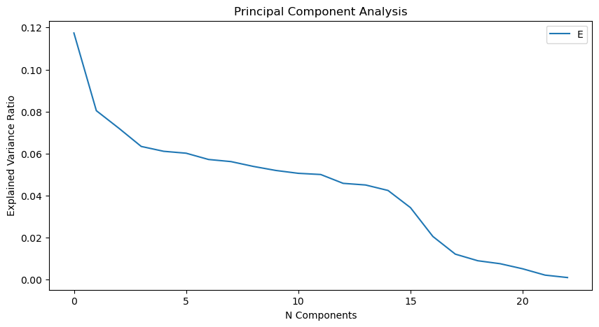](images/image-5.png)

I followed this up with a scree plot to help me determine the variance explained by the principal components
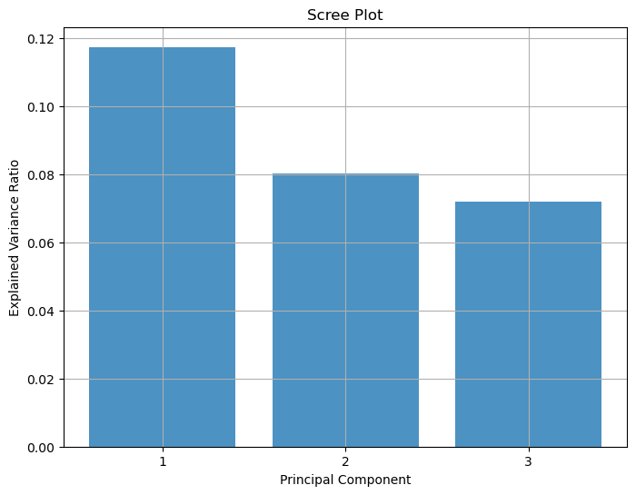](images/image-6.png)

I then created elbow and silhouette plots for my preprocessed data with and without PCA.


### Interpretation

Admittedly I'm a bit lost with my interpretation of the models. The first model seems to have made 2 clusters based off of the number of lyrics in a song and its theme. And I'm not sure at all what the second model with PCA categorized on.

### Without PCA
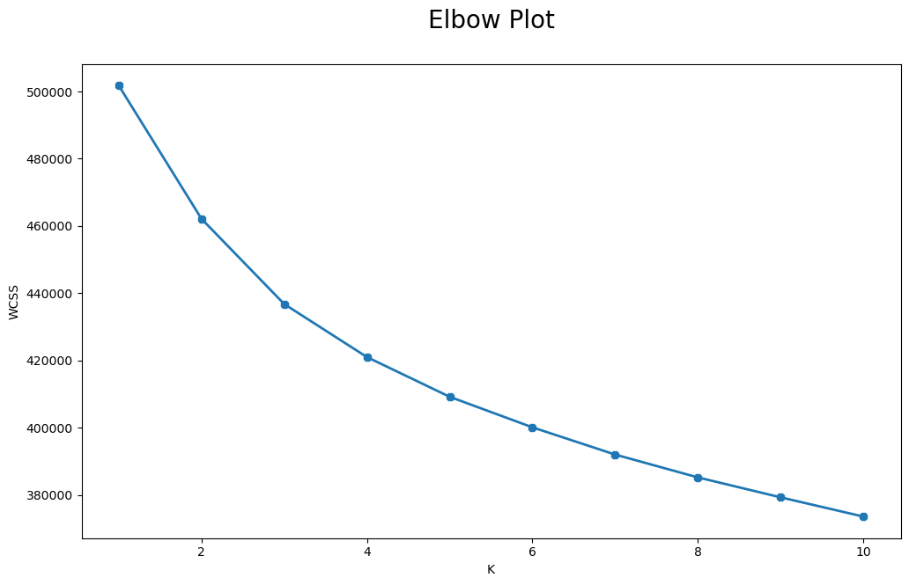](images/image-9.png)
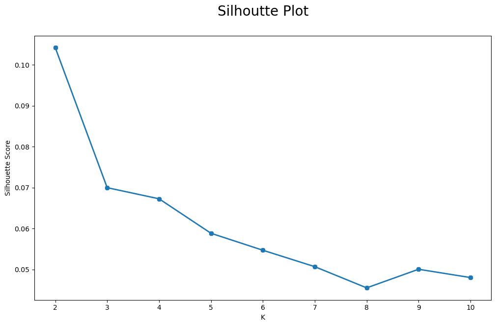](images/image-10.png)
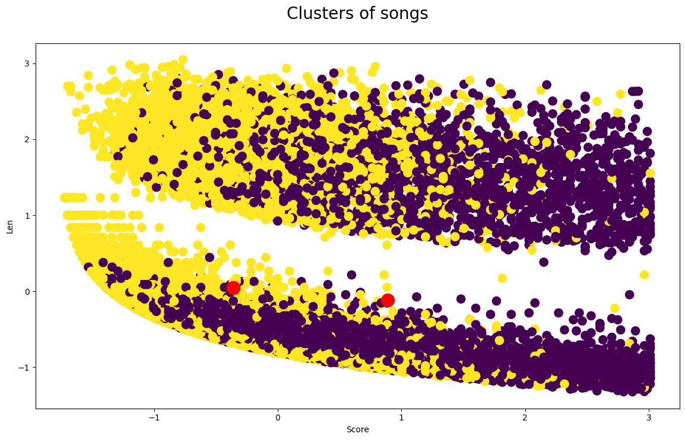](images/image-7.png)
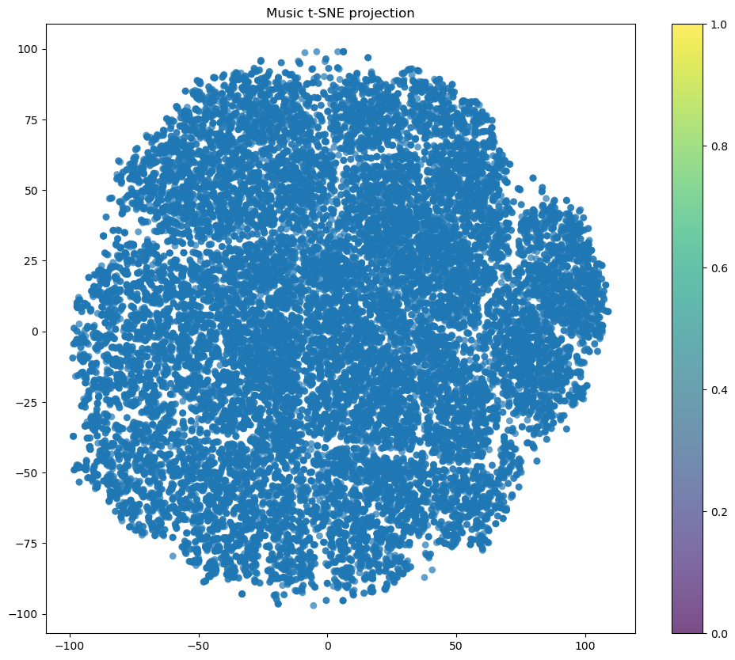](images/image-8.png)

### With PCA
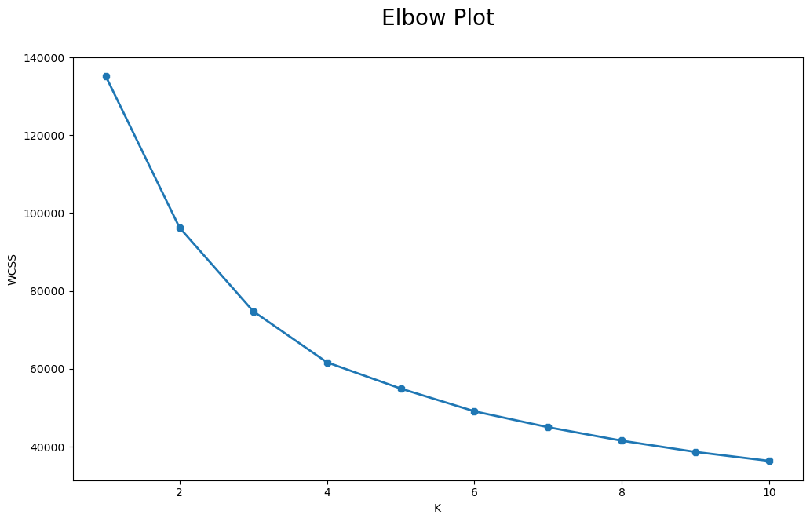](images/image-11.png)
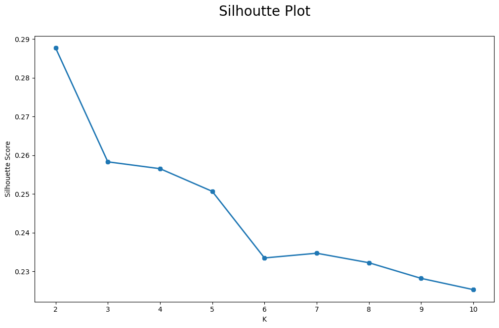](images/image-12.png)
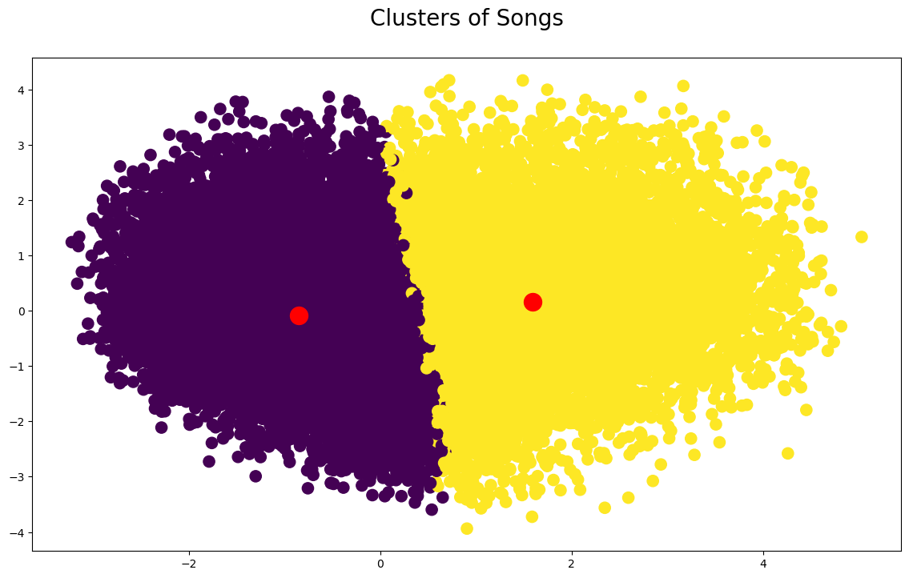](images/image-13.png)
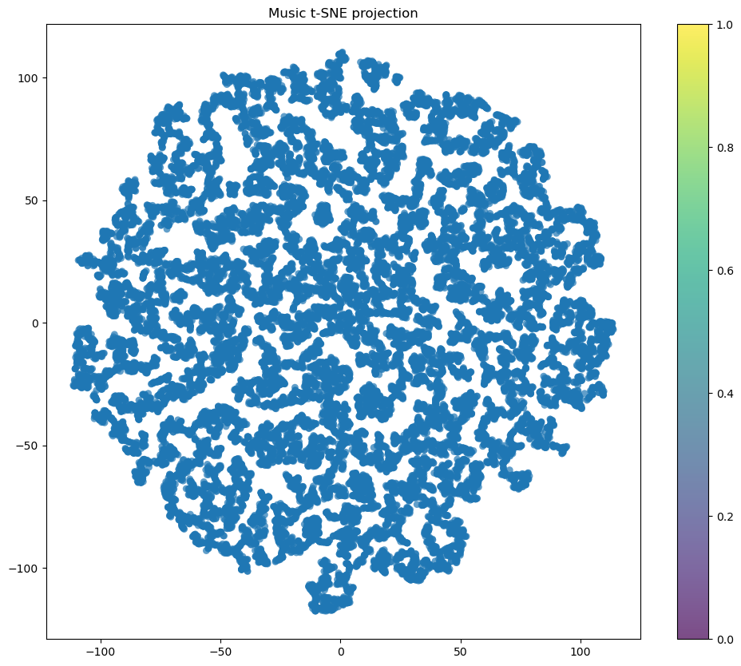](images/image-14.png)

I also created t-SNE plots. another without and with PCA. Unfortunately, I'm not confident in interpretation of these as well.

Lastly I ran through the same process with unsclaed data in 03b_model.ipynb
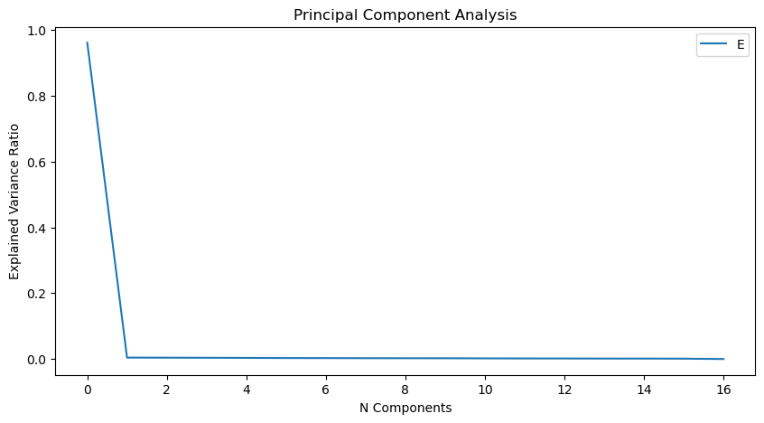](images/image-15.png)

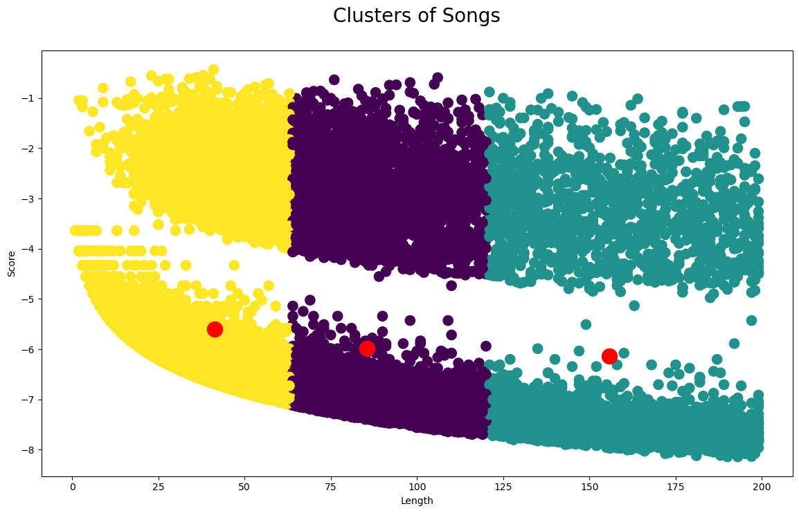](images/image-16.png)

The unscaled data appears to have categorized on length as well

## Conclusion and Further Steps


### Insights

I found an interesting insight. When looking at the scatterplot of the 'dating and 'romantic' columns in music_df_log_t, we find a near perfect correlation of values in the low scoring group. Out of curiousity, I plotted 'dating' vs, 'obscene' and it appears that this pattern exists within this scatterplot as well. I set it aside for now, however I'd like to investigate further to see if this pattern emerges throughout the dataset.

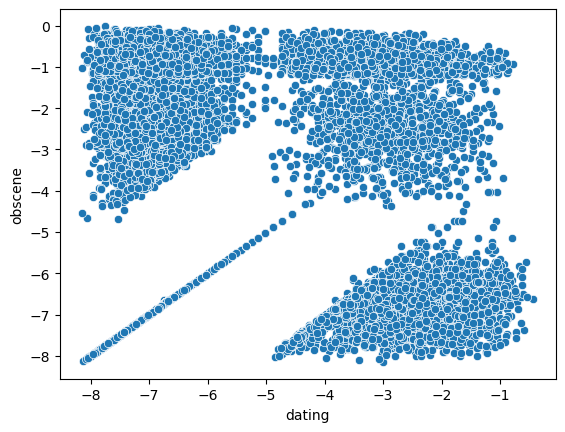](images/image-17.png)


### Challenges

- How to deal with outliers
- Unfamiliarity with unsupervised learning models
- Reconsidering the preprocessing phase
