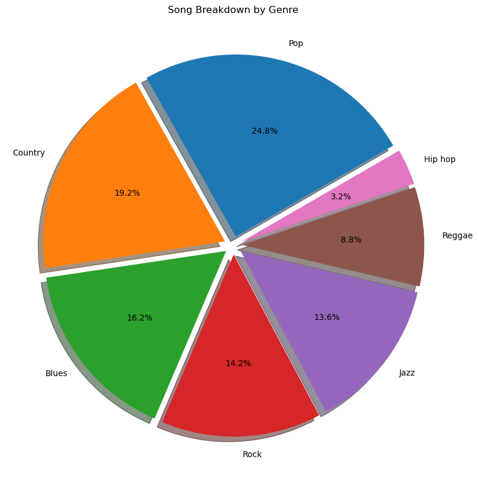

# Fraud Detection with Random Forest Model

## Project Overview


## Dataset Overview

Dataset provided (`..data/raw/recommendation_training_data.csv`)

## Columns


## Goal
Categorize songs

## Project Workflow

### Part 1: Exploratory Data Analysis
#### Load data

```python
import pandas as pd
import numpy as np
import matplotlib.pyplot as plt
import seaborn as sns

df = pd.read_csv('../data/raw/recommendation_training_data.csv')
```
#### Visualizing data


A breakdown of the proportions of transactions by Type


Visualizing the amount of transactions labeled as fraud


##### I created a dataframe that contained only TRANSFER and CASH_OUT transactions. I then created a random sample of 50,000 transactions to continue my EDA. 


#### Discovery!


### Part 2: Data Transformation
Reduced the dataframe to only TRANSFER and CASH_OUT types
1. I figured it would add noise to the model if it were training on labeling fraud from transaction types from which fraud did not exist
2. I needed to reduce the amount of rows in the dataframe


Deleted columns I found to be erroneous. Namely:
```python ['nameOrig', 'nameDest', 'isFlaggedFraud'] ```
*I was considering dropping step however there was a small pattern that emerged at the end of my EDA

Feature engineering
```python 
new_df['amount_equals_oldbalance'] = (new_df['amount'] == new_df['oldbalanceOrg']).astype(int)

new_df['oldbalance_equals_newbalance'] = (new_df['oldbalanceDest'] == new_df['newbalanceDest']).astype(int)
```

Scaled, one hot encoded and saved for modeling


### Part 3: Build Model

Unfortunately the dataset was too large for my machine to handle. I attempted random samples of varying size, however I decided on quite a small sample size in the end. I would like to return and try this in an environment in which I could run across the entire dataframe

#### Build 
- Scale data
- Split
- Model


## Conclusion and Further Steps


### Insights





### Challenges

- How to deal with outliers


### Further steps

